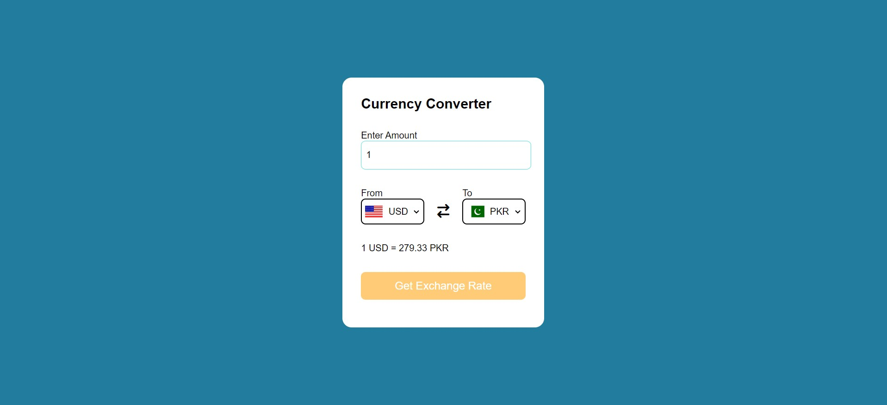

# Currency Converter

A simple currency converter web application that allows users to convert currency values from one currency to another.

## Features

- Converts currency values from one currency to another based on the latest exchange rates.
- Supports a wide range of currencies.
- User-friendly interface with easy-to-use dropdown menus for selecting currencies.

## Technologies Used

- HTML5
- CSS3
- JavaScript

## How to Use

1. Go to [https://currency-ex-change.netlify.app/]
2. Enter the amount you want to convert and select the currencies you want to convert from and to.
3. The converted amount will be displayed instantly.

## Demo

You can view a live demo of the Currency Converter [here](https://currency-ex-change.netlify.app/)

## Screenshots

## Credits

- Currency data provided by [fawazahmed0](https://github.com/fawazahmed0/currency-api).

## License

This project is licensed under the [MIT License](LICENSE).

